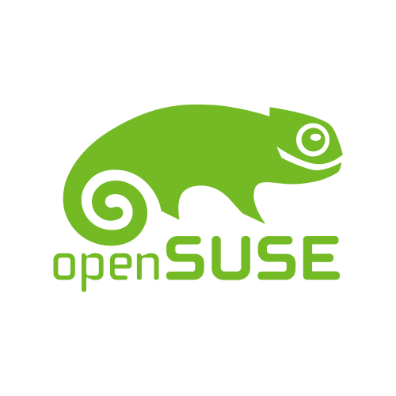

<h2 align="center" style="font-family: 'Verdana';">An Enthusiastic Developer</h2>

  

     I love to write code. I was in higher secondary school when I wrote my first line of code in Python, just loved it, and after that, I couldn't stop myself from learning. So, I spent tons of time learning by myself. To be able to write something in the text file that a machine can understand fascinated me more than anything.

  

This hobby led me to various different domains of programming, which include front-end, back-end, Web-scraping, and API development. I don't want to stop learning, neither do I want to slow down my learning, so I chose web development as my domain as it rapidly changes over time, and there's always something to learn even for experienced ones, but it's not guaranteed that I'll stay here forever either. If I find something more challenging in programming, I may start learning that as well. :sweat_smile:
    
 
  

  

<h3 align="center">Technologies that I like to work with: </h3>

  

    

      

 
<h3 align="center" style="font-family: 'Ubuntu';"> Contact </h3>

<!--gmail-->

<!--gmail ends-->
<!--linkedin starts-->

<!--linkedin ends-->

 

<h3 align="center" style="font-family: 'Ubuntu';"> Social Media </h3>

