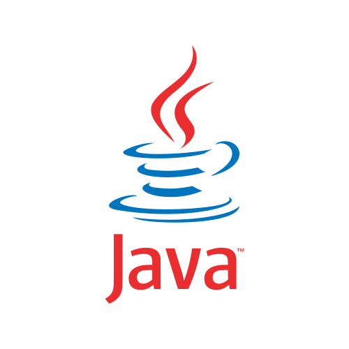

<!---->
<h1>Hi, I'm Sajid 👋</h1>

  

  

     I love to write code. I was in higher secondary school when I wrote my first line of code in Python, just loved it, and after that, I couldn't stop myself from learning. So, I spent tons of time learning by myself. To be able to write something in the text file that a machine can understand fascinated me more than anything.

  

This hobby led me to various different domains of programming, which include front-end, back-end, Web-scraping, and API development. I don't want to stop learning, neither do I want to slow down my learning. It's fascinating how software engineering rapidly changes over time and there's always something to learn even for experienced ones.
    
 
  

<h3>Languages and Tools: </h3>

 

<h3 align="left">Connect with me:</h3>

 

<!---->
